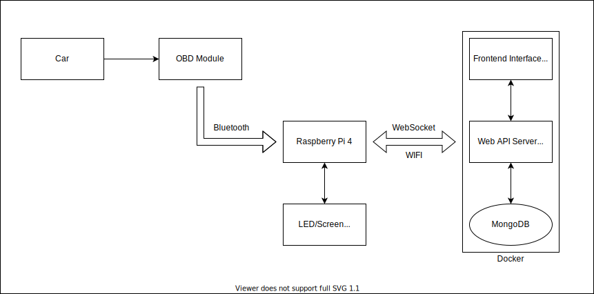

# vroom-stats

This project aims to retrieve car engine stats and store them in a webserver to allow any user to know what happens in their car.

## Architecture

The project is divided in multiple parts: 



### OBD Module

It is a Super Mini ELM327 V2.1 that supports Bluetooth.

### Raspberry Pi 4

The Raspberry will allow us to:
 - Gather the data from the OBD module to send them to the webserver
 - Show some stats that are given by the webserver

It will also use LEDs, or a screen, to show a few things we will eventually chose.

### Web API

The web API (.NET 6) will consist of an API with Rest and WebSocket endpoints to append and retrieve data of a car by a webapp or the Raspberry Pi on a car.

#### API Endpoints

Get the latest known values for a specific car:
- GET /api/v1/cars/{carId} 

Register a new car by its unique id:
- POST /api/v1/cars/{carId}

Append new values for a specific car:
- POST /api/v1/cars/{carId}/data

Get all the known registered cars:
- GET /api/v1/cars

WebSocket connection to a specific car:
- ws://webhost:webport/api/v1/ws/{carId}

The different values gathered are stored in a MongoDB server.

### Web App

The web App, made with React, will consist of some pages, one with a list of all the registered cars, and then a complete summary of each car, with history and real-time data automatically updating the webpage.

### Raspberry Pi App

The app that will run on Raspberry, made with .NET 6, will allow us to easily interact with the stream of data received from the OBD and automatically send everything to the remote web API.

### Wifi Module

To send the information from the Raspberry to the Webserver, we will use a WIFI to easily connect to the internet.

## Requirements

### Softwares (With Docker)

- Docker & Docker Compose

### Softwares (Without Docker)

- .NET 6 SDK
- NodeJs
- ReactJs
- Git

### Hardware

- Raspberry Pi 4 (with Wifi and Bluetooth)
- Super Mini ELM327

## Resources 

- [Microsoft .NET IOT Documentation](https://docs.microsoft.com/en-us/dotnet/iot/)
- [Windows COM Simulation](https://www.virtual-serial-port.org/)
- [OBD Simulation](https://github.com/Ircama/ELM327-emulator)
- [OBD.NET](https://github.com/DarthAffe/OBD.NET)
- [OBD II PIDs](https://en.wikipedia.org/wiki/OBD-II_PIDs)

## Run

### Web part

```
$ git clone https://github.com/Kiritsu/vroom-stats
$ cd vroom-stats
$ sudo docker-compose up -d
```

Then open your browser at the following address: https://localhost

### Raspberry Pi part

```
$ git clone https://github.com/Kiritsu/vroom-stats
$ cd vroom-stats
$ sudo docker build . -f docker/pi-obd/Dockerfile -t pi-obd:latest
$ sudo docker run --restart always -e Obd__SerialPort=rfcomm1 -e WebApi__Host=vroom.alnmrc.com -e WebApi__Port=443 pi-obd:latest
```

Replace rfcomm1 by your set-up serial port
